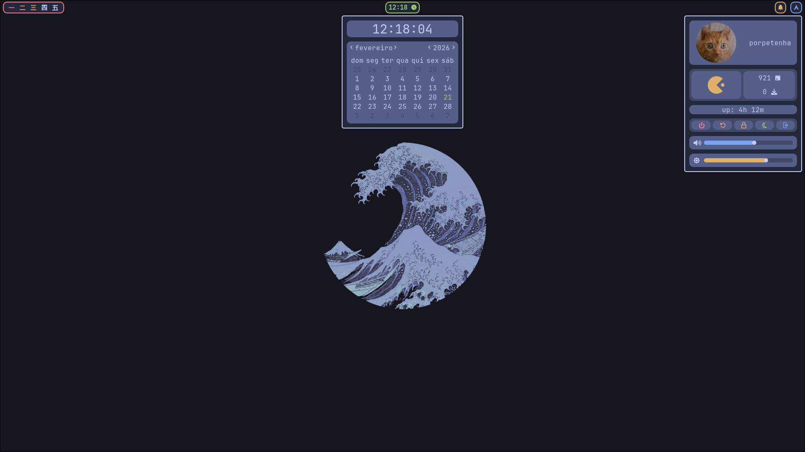
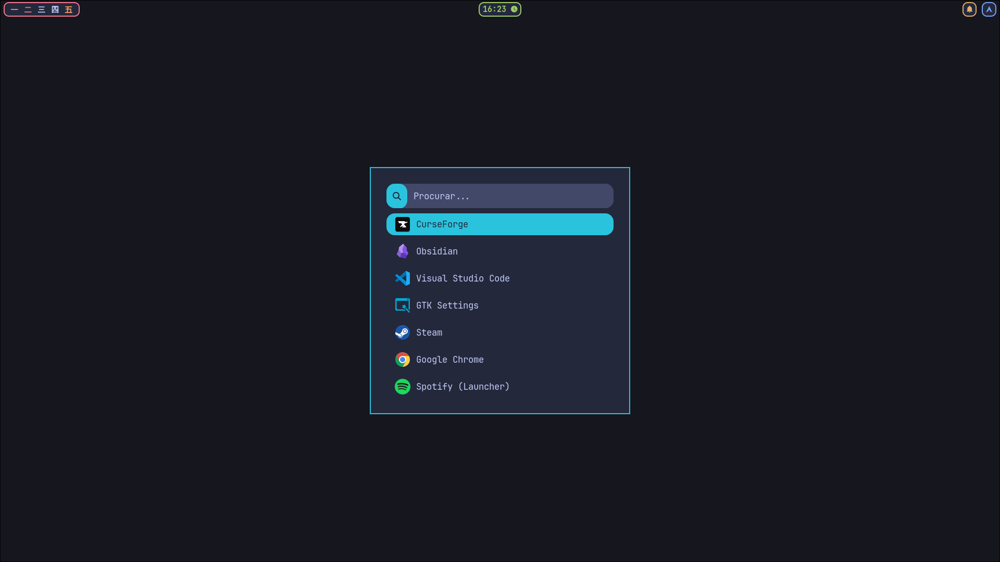
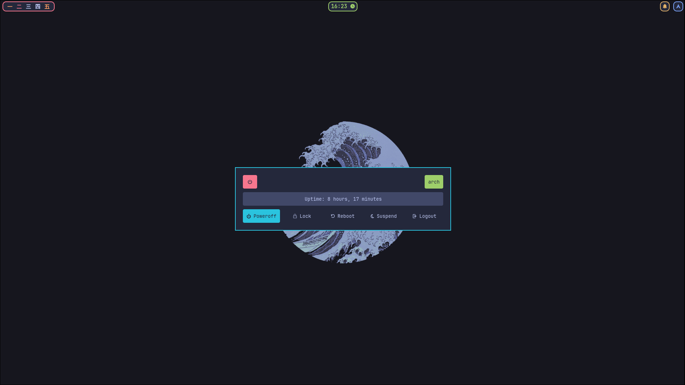
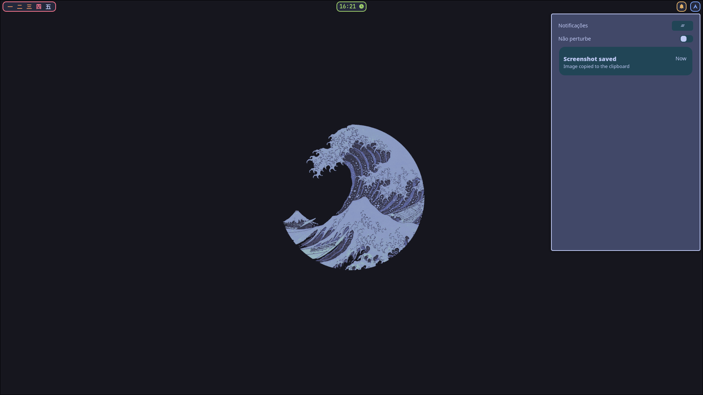
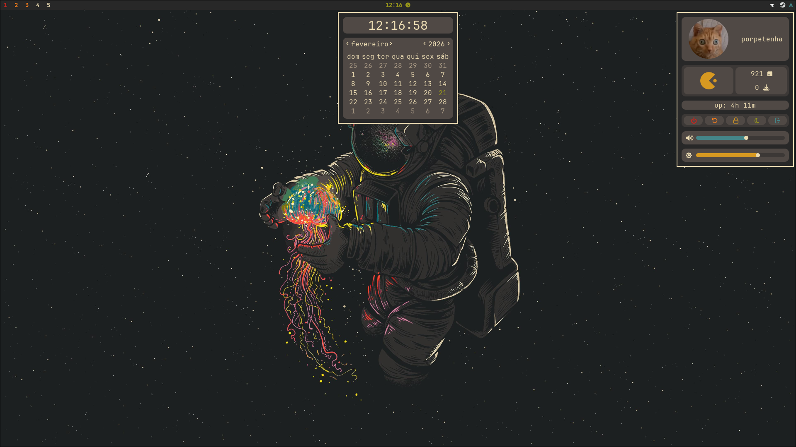
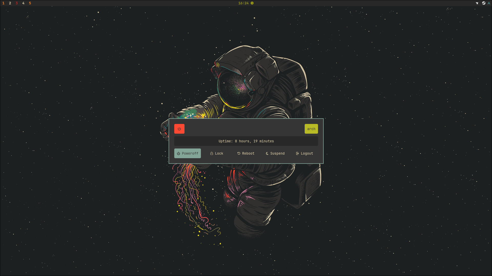
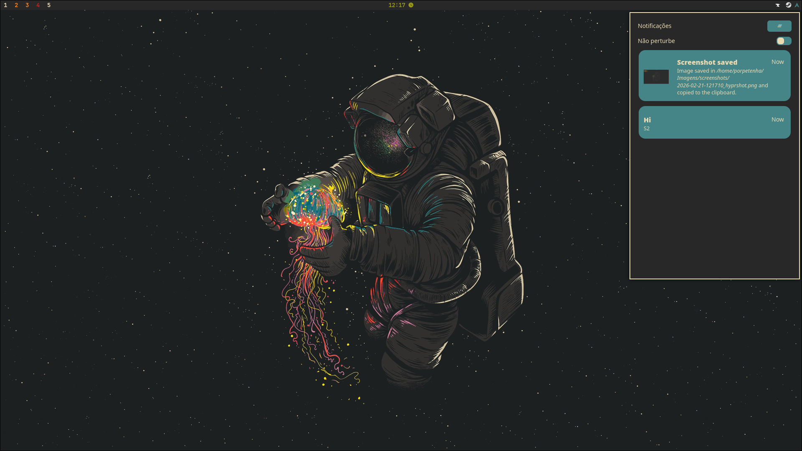
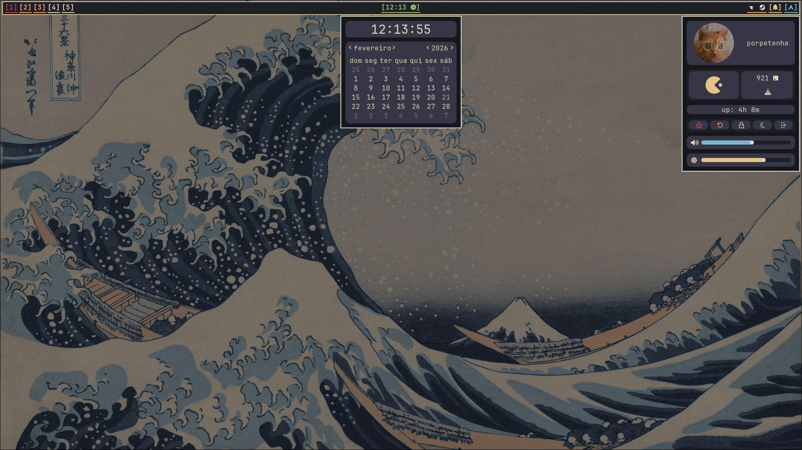
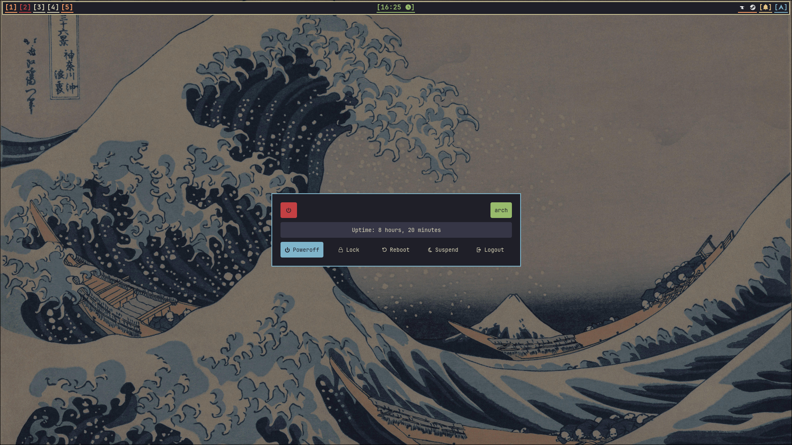
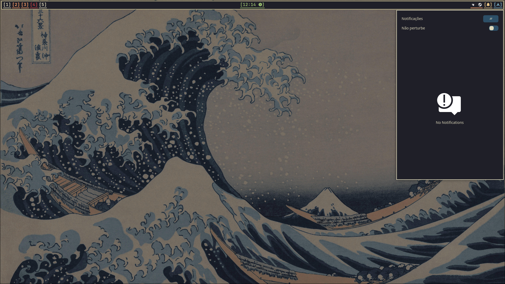

# My Dotfiles Hyprland

---
## 🎨 Dynamic Themes

Através do script `theme-switcher.sh`, é possível alternar globalmente entre diferentes estéticas que modificam os principais componentes da configuração. Sendo assim, é muito fácil criar novas configurações de ricing. 

O script foi escrito por uma IA (Gemini), precisando de vez ou outra de intervenção manual para configurações adicionais. 

Quando o script é executado basta selecionar o numero correspondente ao tema e aguardar alguns segundos para finalizar. Existe também um meno com o Rofi para alterar, a keybind configurada é o `SUPER + L`.

- [**Tokyo-Night**](#Tokyo-Night): Azul com estetica neon;
- [**Gruvbox**](#Gruvbox): Tons terrosos e cores vibrantes;
- [**Kanagawa**](#Kanagawa): Azul marinho e branco areia; 
- [**Catppucin-Mocha**](#Catppucin-Mocha): Em breve.

---
## 🛠️ Componentes do Sistema

| **Componente** | **Pacotes** |
| -------------- | ----------- |
| Window Manager | Hyprland    |
| Status Bar     | Waybar      |
| Terminal       | Kitty       |
| App Launcher   | Rofi        |
| Notifys        | SwayNC      |
| Widgets        | EWW         |
| Shell Prompt   | Starship    |
| File Menager   | Thunar      |

## Icones e temas

- Tokyo-Night
    - Icons: Papirus (Red Folder)
    - Cursor: [Moga-Negon-Blue](https://www.pling.com/p/2302110)
    - GTK Theme: [Tokyonight GTK Theme - Dark-Storm-BL-MB](https://www.pling.com/p/1681315/)(Thunar modification)

- Gruvbox
    - Icone: Papirus (Brown Folder)
    - Cursor: [Future-cursors](https://www.pling.com/p/1457141)
    - GTK Theme: [Gruvbox GTK Theme - Dark-BL-MB](https://www.pling.com/p/1681313/)(Thunar modification)

- Kanagawa
    - Icone: Papirus (Paleorange Folder)
    - Cursor: [Moga-Sandy](https://www.pling.com/p/2297654)
    - GTK Theme: [Kanagawa GTK Theme - Dark-BL-MB ](https://www.pling.com/p/1810560)(Thunar modification)

Autor dos temas GTK: [Fausto-Korpsvart](https://github.com/Fausto-Korpsvart)
---
## 📸 Screenshots

### Tokyo Night

### Gruvbox

### Kanagawa

---