# My Dotfiles Hyprland
---
## 🎨 Dynamic Themes

Through the `theme-switcher.sh` script, it is possible to globally switch between different aesthetics that modify the main components of the configuration. Therefore, it is very easy to create new ricing setups. 

The script was written by an AI (Gemini), occasionally requiring manual intervention for additional configurations. 

When the script is executed, simply select the number corresponding to the theme and wait a few seconds for it to finish. There is also a Rofi menu to change it; the configured keybind is `SUPER + L`.

  
   
  <a href="#tokyo-night"><b>Tokyo-Night</b></a> 
  Blue with a neon aesthetic;

  
   
  <a href="#gruvbox"><b>Gruvbox</b></a> 
  Earthy tones and vibrant colors;

  
   
  <a href="#kanagawa"><b>Kanagawa</b></a> 
  Navy blue and sand white; 

---
## 🛠️ Components

### Packages

| **Component** | **Packages** |
| ------------- | ------------ |
| Window Manager| Hyprland     |
| Status Bar    | Waybar       |
| Terminal      | Kitty        |
| App Launcher  | Rofi         |
| Notifys       | SwayNC       |
| Widgets       | EWW          |
| Shell Prompt  | Starship     |
| File Manager  | Thunar       |

### Icons and Themes

- Tokyo-Night
    - Icon: Papirus (Red Folder)
    - Cursor: [Moga-Candy-Macchiato](https://www.opendesktop.org/p/2299255)
    - GTK Theme: [Tokyonight GTK Theme - Dark-Storm-BL-MB](https://www.pling.com/p/1681315/) (Thunar modification)
    - VS Code Theme: [Tokyo Night](https://marketplace.visualstudio.com/items?itemName=enkia.tokyo-night)

- Gruvbox
    - Icon: Papirus (Brown Folder)
    - Cursor: [Moga-Candy-Grey](https://www.opendesktop.org/p/2299255)
    - GTK Theme: [Gruvbox GTK Theme - Dark-BL-MB](https://www.pling.com/p/1681313/) (Thunar modification)
    - VS Code Theme: [Gruvbox Theme](https://marketplace.visualstudio.com/items?itemName=jdinhlife.gruvbox)

- Kanagawa
    - Icon: Papirus (Paleorange Folder)
    - Cursor: [Moga-Sandy](https://www.pling.com/p/2297654)
    - GTK Theme: [Kanagawa GTK Theme - Dark-BL-MB ](https://www.pling.com/p/1810560) (Thunar modification)
    - VS Code Theme: [Kanagawa](https://marketplace.visualstudio.com/items?itemName=qufiwefefwoyn.kanagawa) 

GTK themes author: [Fausto-Korpsvart](https://github.com/Fausto-Korpsvart)

---
## 📸 Screenshots

### Tokyo Night

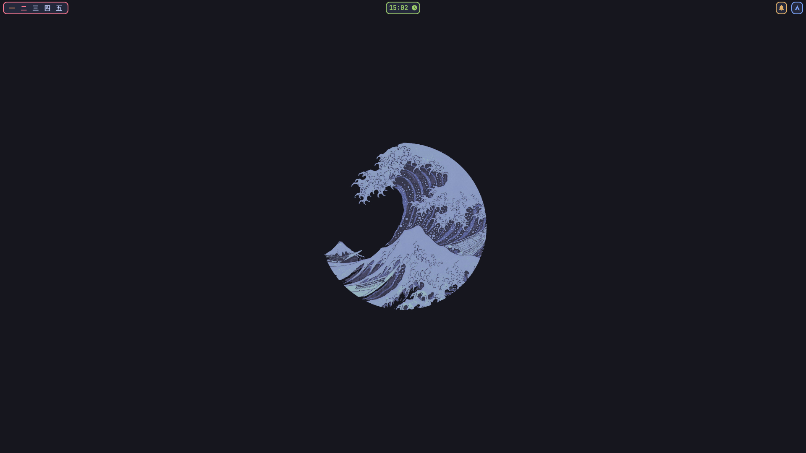
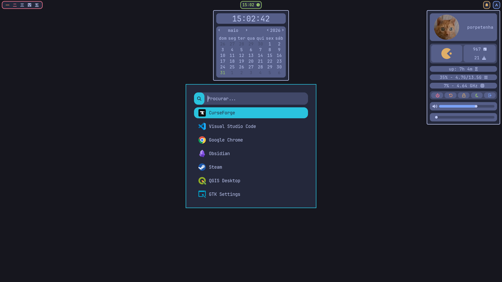
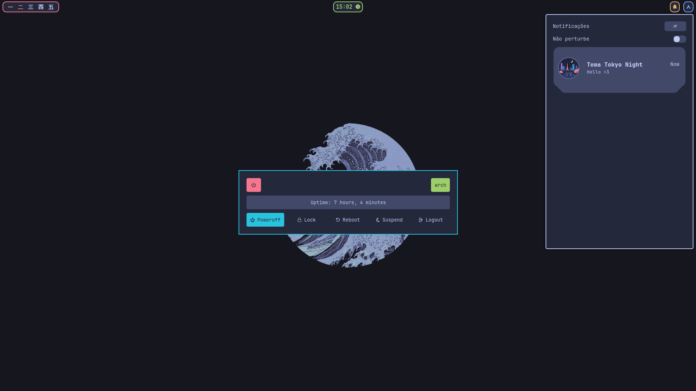
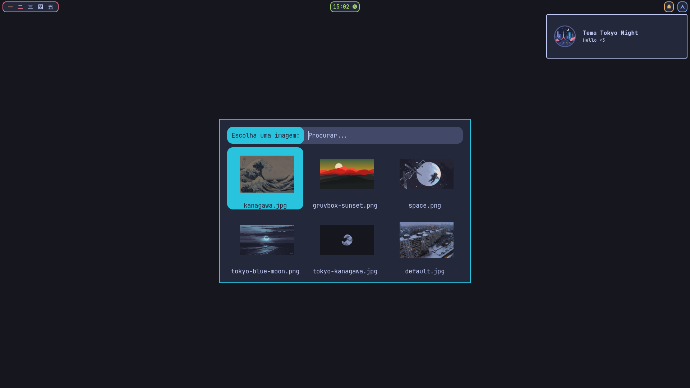
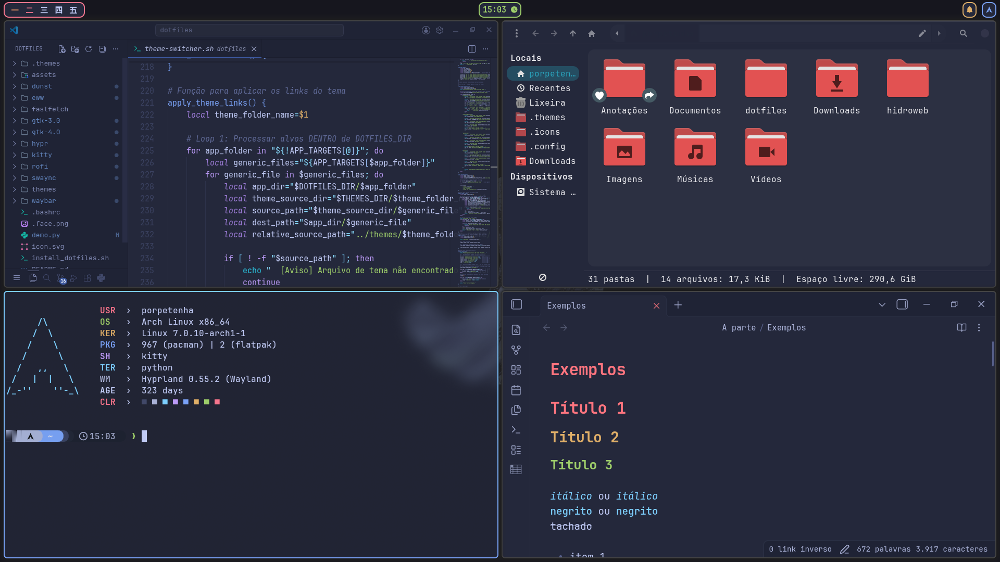

### Gruvbox

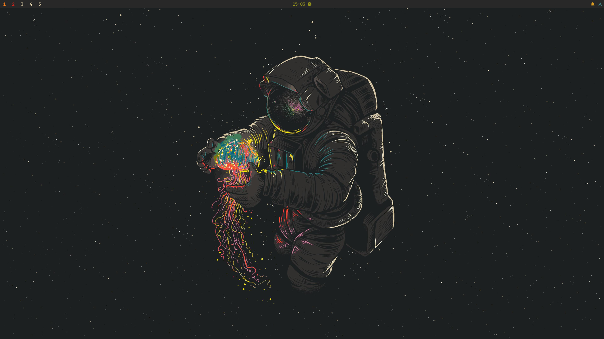
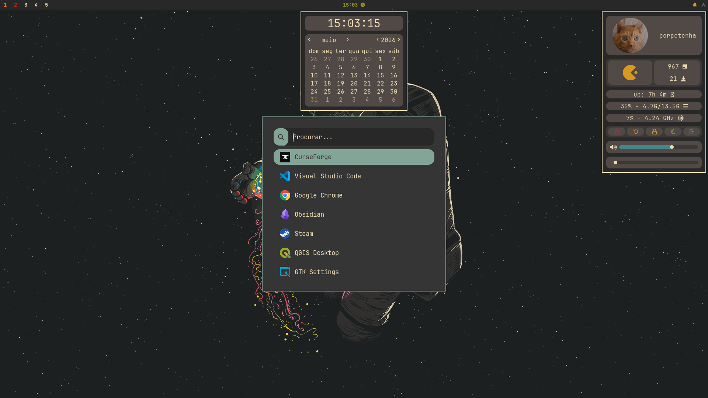
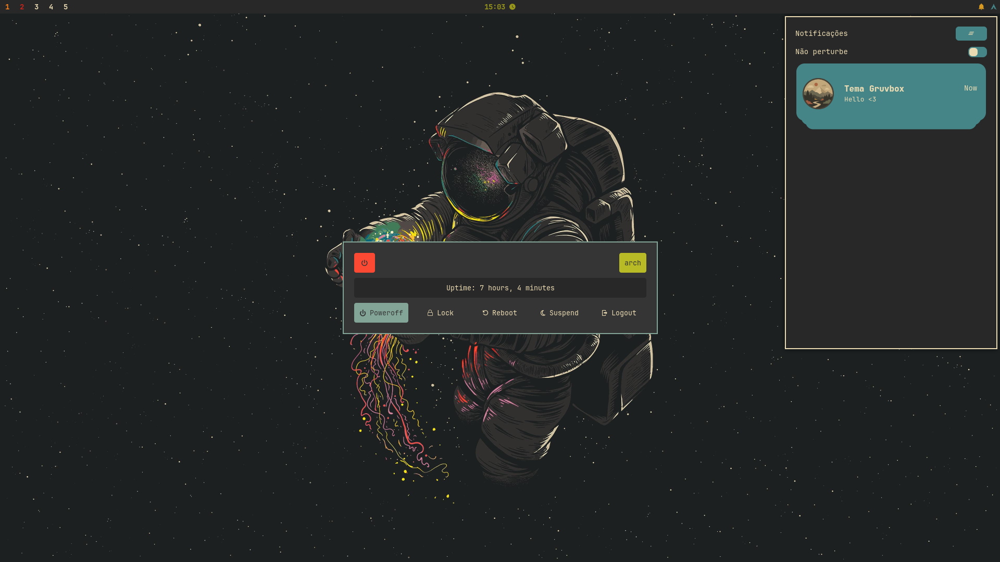
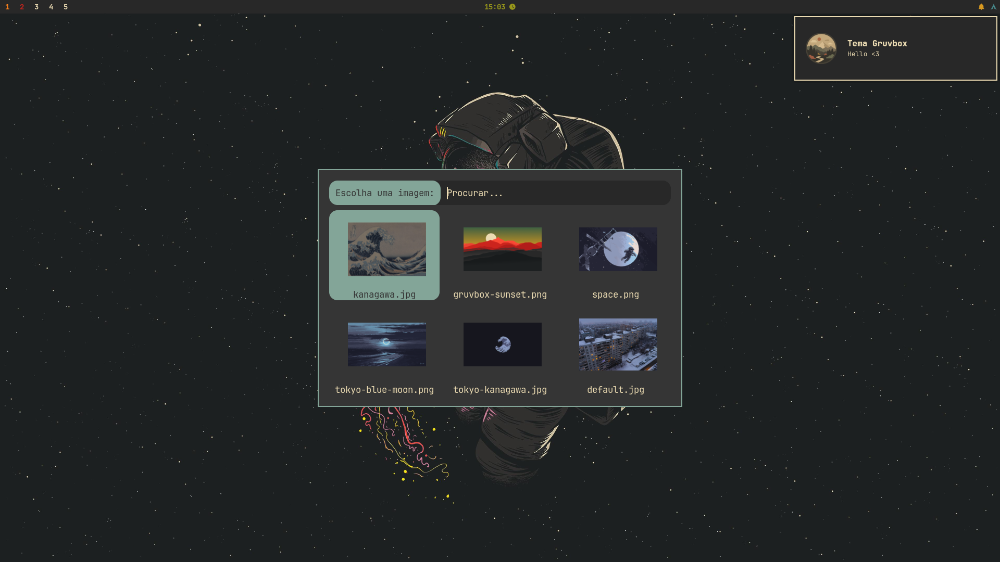
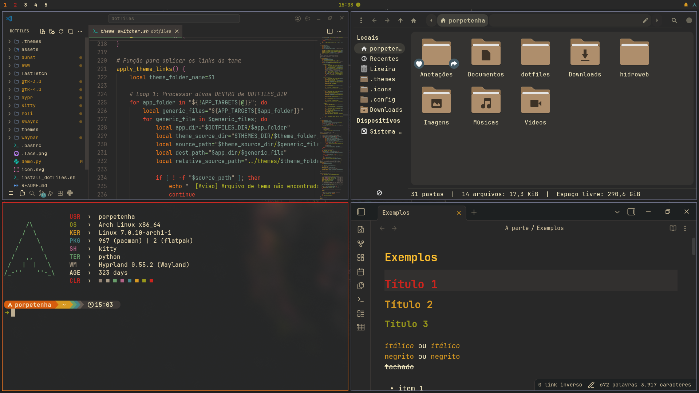

### Kanagawa

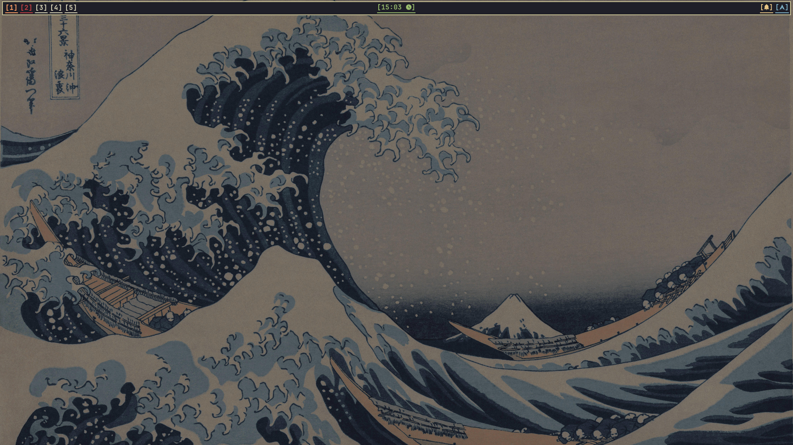
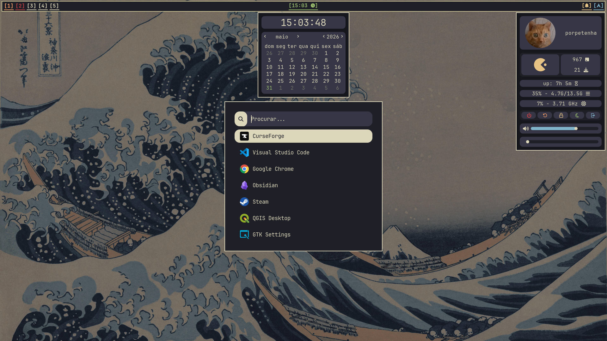
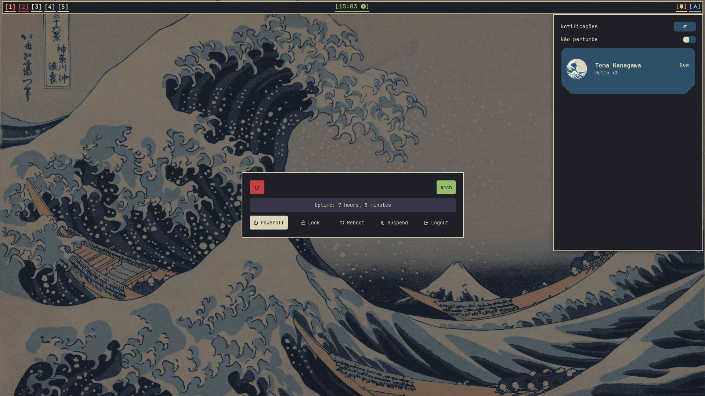
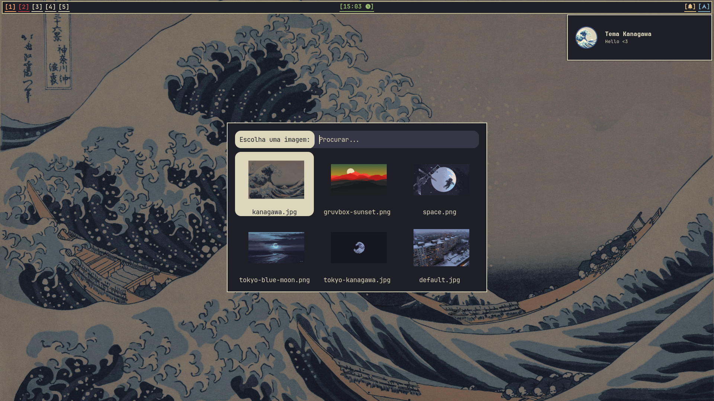
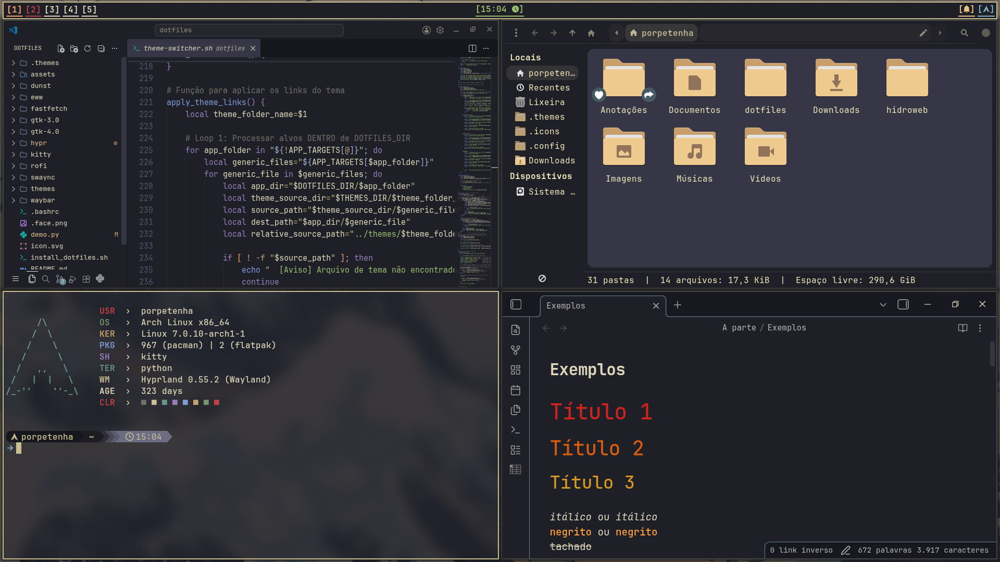

---